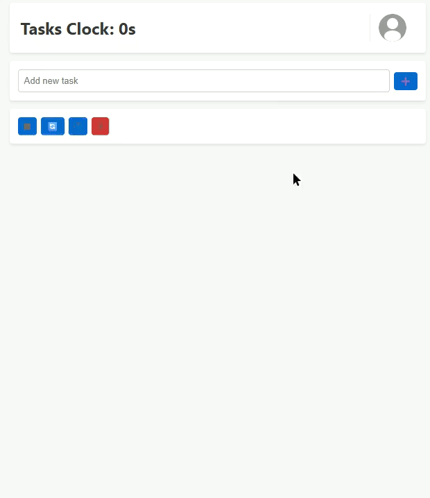

# Clock Tasks

A minimalist time tracking application that helps you understand where your time goes. Click tasks to start tracking, click another to switch. Simple, visual, and syncs to the cloud.



## Features

- **One-Click Tracking** - Click any task to start timing, click another to switch instantly
- **Visual Time Distribution** - See at a glance what's consuming your time with proportional task bars
- **Google Drive Sync** - Your data syncs automatically across devices via Google Drive
- **Guest Mode** - Try it immediately without signing in (local storage only)
- **Real-time Updates** - Watch your time accumulate in real-time
- **Clean Architecture** - Framework-agnostic core logic that can be reused anywhere

## Quick Start

### Development

```bash
# Install dependencies
npm install

# Start development server (port 7428)
npm start

# Run tests
npm test

# Run tests with UI
npm test:ui

# Build for production
npm build
```

### Usage

1. **Sign in** with Google (or continue as guest)
2. **Add tasks** by typing in the input field and pressing Enter
3. **Click tasks** to start/switch between them
4. **Rename tasks** by clicking the name and editing inline
5. **Delete tasks** via the delete button (appears on hover)
6. **Reset all timers** with the reset button in controls

Your data automatically saves to your selected cloud provider when signed in, or localStorage in guest mode.

## Architecture

The project follows a clean architecture with strict separation of concerns:

```
clock-tasks/
├── src/
│   ├── core/              # Framework-agnostic business logic
│   │   ├── types.ts       # Data structures and interfaces
│   │   ├── calculations.ts # Pure time calculation functions
│   │   ├── taskManager.ts  # State operations and queries
│   │   ├── storage.ts      # Storage abstraction layer
│   │   ├── timeFormatter.ts # Time formatting utilities
│   │   └── index.ts        # Public API
│   │
│   ├── components/        # React UI components
│   │   ├── LoginComponent.tsx
│   │   ├── AddTaskForm.tsx
│   │   ├── TaskList.tsx
│   │   ├── TaskItem.tsx
│   │   ├── UserHeader.tsx
│   │   └── Controls.tsx
│   │
│   ├── hooks/             # Custom React hooks
│   │   ├── useTaskState.ts
│   │   ├── useTaskHandlers.ts
│   │   ├── useSyncEffect.ts
│   │   ├── useUIState.ts
│   │   └── useSortedTasks.ts
│   │
│   ├── services/          # External service integrations
│   │   ├── providers/     # Auth + storage provider adapters and factory
│   │   │   ├── providerConfig.ts
│   │   │   ├── firebaseAuthProvider.ts
│   │   │   ├── firebaseStorageProvider.ts
│   │   │   ├── googleAuthProvider.ts
│   │   │   ├── googleDriveStorageProvider.ts
│   │   │   └── types.ts
│   │   ├── firebaseConfig.ts
│   │   └── firebaseService.ts
│   │
│   ├── utils/             # Application utilities
│   │   ├── authHelpers.ts
│   │   ├── storageHelpers.ts
│   │   └── logger.ts
│   │
│   ├── types/             # Application-specific types
│   │   └── index.ts       # User type and core re-exports
│   │
│   ├── App.tsx            # Main application component
│   └── main.tsx           # Application entry point
│
├── vite.config.ts         # Vite configuration
├── tsconfig.json          # TypeScript configuration
└── vitest.config.ts       # Test configuration
```

## Provider Adapter Architecture & Guidelines

This app uses an adapter-style provider paradigm for authentication and storage. Providers can be swapped without touching app logic.

- Interface-driven: all storage providers implement the same `StorageProvider` interface (save, load, startListening, stopListening, clear, setUserId)
- Encapsulated behavior: polling intervals or real-time listeners live inside each provider
- Factory-based selection: `src/services/providers/providerConfig.ts` picks auth+storage based on `VITE_AUTH_PROVIDER` or localStorage
- Plug-and-play: identical data shape and methods keep app code compatible
- Auth coupling: each storage provider pairs with its matching auth provider (Firebase with Firebase Auth; Google Drive with Google OAuth via a shared token store)

### Current Providers
- Firebase: real-time push via Realtime Database, hierarchical path `users/{userId}/tasks`, instant cross-tab updates, server-side conflict handling
- Google Drive: polling every ~10s via REST API, stores a single `tasks.json` file in a `ClockTasks` folder, quota-sensitive, consistent interface

### Adding New Providers (e.g., Supabase)
1. Implement the `StorageProvider` interface
2. Keep provider-specific details internal (listeners/polling/auth token handling)
3. Update `providerConfig.ts` to instantiate the new provider pair
4. Verify save/load/listen/clear semantics and identical data format

### Configure Provider
- Env var: set `VITE_AUTH_PROVIDER` to `firebase` or `google`
- Local override: `localStorage.setItem('authProvider', 'firebase' | 'google')`

Notes: Migration docs have been removed; the README is the single source for provider setup.

### Key Design Principles

1. **Core Logic Isolation** - Business logic in `src/core/` has zero React dependencies and can run in Node.js, CLI, or any other environment

2. **Immutable State** - All operations return new state objects; no mutations

3. **Path Aliases** - Consistent imports using `@/core`, `@/components`, `@/hooks`, `@/utils`, `@/services`

4. **Type Safety** - Full TypeScript coverage with strict mode enabled

5. **Pure Functions** - Calculations are deterministic with no side effects

## How Time Tracking Works

The system uses a **history-based** approach:

1. Each task click records a `ClickEvent` with a timestamp
2. Time is calculated by measuring intervals between consecutive clicks
4. Current running time is computed as `now - lastClickTimestamp`

**Example Timeline:**
```
10:00 → Click "Code"        → Code starts
10:30 → Click "Meeting"     → Code: 30min, Meeting starts
11:00 → Click "Code"        → Meeting: 30min, Code resumes
11:15 → (current time)      → Code: 30min + 15min = 45min total
```

- No timers or intervals needed
- Time persists perfectly across app restarts
- Queries are just calculations over immutable history
- Can reconstruct any point in time

## Core Module API

The `@/core` module exports a complete, framework-agnostic API:

### TaskOperations (State Mutations)
```typescript
import { TaskOperations } from '@/core'

TaskOperations.addAndStartTask(name, state)   // Add and immediately start
TaskOperations.startTask(taskId, state)       // Start/switch to task
TaskOperations.updateTaskName(id, name, state) // Rename task
TaskOperations.deleteAllTasks(state)          // Clear all tasks
TaskOperations.resetAllTasks(state)           // Reset all timers
TaskOperations.pauseCurrentTask(state)        // Pause current task
```

```typescript
import { TaskQueries } from '@/core'

TaskQueries.getAllTasks(state, now)           // Get all tasks with computed times
TaskQueries.getTask(taskId, state, now)       // Get single task
TaskQueries.getCurrentRunningTaskId(state)    // Get active task ID
TaskQueries.taskExists(taskId, state)         // Check existence
```

### Storage Backends

```typescript
import { LocalStorageBackend, InMemoryBackend } from '@/core'

// Use localStorage
const storage = new LocalStorageBackend()

// Or in-memory (for testing)
const storage = new InMemoryBackend()

// Interface:
await storage.load()        // → { tasks, history, lastModified }
await storage.save(data)    // → void
await storage.clear()       // → void
```

### Utilities

```typescript
import { formatTime } from '@/core'

formatTime(45)      // "45s"
formatTime(120)     // "2.0m"
formatTime(3661)    // "1.0h"
```

## Data Types

```typescript
// Stored data
interface TaskData {
  id: string      // Unique ID (timestamp-based)
  name: string    // Task name
}

interface ClickEvent {
  taskId: string    // Which task was clicked
  timestamp: number // Unix timestamp (ms)
}

interface StoredData {
  tasks: TaskData[]
  history: ClickEvent[]
  lastModified: number
}

// Computed data (not stored)
interface Task {
  id: string
  name: string
  isRunning: boolean          // Is this currently active?
  currentSessionTime: number  // Current session duration (seconds)
  lastSessionTime: number     // Previous session duration (seconds)
  totalTime: number           // Total accumulated time (seconds)
}
```

## Testing

The project uses Vitest for testing with comprehensive coverage:

```bash
# Run all tests
npm test

# Watch mode with UI
npm test:ui

# Coverage report
npm test:coverage
```

Tests are organized by module:
- `core/calculations.test.ts` - Time calculation logic
- `core/taskManager.test.ts` - State operations
- `core/storage.test.ts` - Storage backends
- `utils/*.test.ts` - Utility functions

All core logic is pure functions, making tests deterministic and fast.

## Cloud Provider Integration

The app supports multiple cloud providers for data sync:

- Firebase: real-time sync via listeners, instant updates, hierarchical data, integrated authentication.
- Google Drive: polling-based sync (every ~10s), data stored as `tasks.json` in Drive folder, uses Google OAuth.

### Setup Requirements

- Google Drive: create a `.env` file with your Google OAuth credentials:
  ```env
  VITE_GOOGLE_CLIENT_ID=your-client-id-here.apps.googleusercontent.com
  ```
- Firebase: configure your Firebase project in `src/services/firebaseConfig.ts`.

## Technology Stack

- **React 19** - UI framework
- **TypeScript** - Type safety
- **Vite** - Build tool and dev server
- **Vitest** - Testing framework
- **Google OAuth** - Authentication
- **Google Drive API** - Cloud storage
- **ESLint** - Linting
- **React Compiler** - Automatic optimization

## Browser Support

- Modern evergreen browsers (Chrome, Firefox, Safari, Edge)
- Requires ES2022+ JavaScript features
- LocalStorage and Fetch API required

## Contributing

The project follows these conventions:

- **Imports** - Use `@/` path aliases consistently
- **Types** - Define in `core/types.ts` or `types/index.ts`
- **Logging** - Use `createLogger('ModuleName')` from `@/utils/logger`
- **State** - Never mutate; always return new objects
- **Tests** - Co-locate with source files (`*.test.ts`)
- **Naming** - `camelCase` for files, `PascalCase` for components

## Use Cases

The framework-agnostic core enables multiple frontends:

- ✅ **Current: React Web App** - Running at port 7428
- 🎯 **Potential: CLI Tool** - Import core in Node.js script
- 🎯 **Potential: Mobile App** - React Native with same core
- 🎯 **Potential: Desktop App** - Electron wrapper
- 🎯 **Potential: VS Code Extension** - Panel in editor
- 🎯 **Potential: API Server** - Express.js with core logic

All sharing the same battle-tested business logic.

## License

Private project - All rights reserved

## Acknowledgments

Built with a focus on simplicity, clean architecture, and developer experience.
